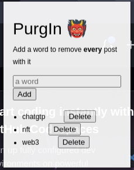

# PurgIn 👹

> **Warning**
> Work in Progress

Chrome extension to automatically remove **LinkedIn** posts containing user-defined words.

PurgIn can be installed from the [**chrome store**](https://chrome.google.com/webstore/search/purgin?hl=it&authuser=0)

Every LinkedIn post containing words `chatgpt, nft, web3` will be removed from your feed.

Here an example with the word `the`, so basically almost every posts

## Install it

### Chrome Store

PurgIn can be installed from the [**chrome store**](https://chrome.google.com/webstore/search/purgin?hl=it&authuser=0)

### Local

To install it locally, clone this repo then

- go to your extension setting page `chrome://extensions/`
- check the box for `Developer mode`
- click on `Load unpacked extension` and select the folder `extension` in the cloned repo

Check [here](https://www.cnet.com/tech/services-and-software/how-to-install-chrome-extensions-manually/)

## Dev

Useful stuff

[extension doc](https://developer.chrome.com/docs/extensions/mv3/getstarted/extensions-101/)

[messaging passing doc](https://developer.chrome.com/docs/extensions/mv3/messaging/)

[local storage doc](https://developer.chrome.com/docs/extensions/reference/storage/#overview)
